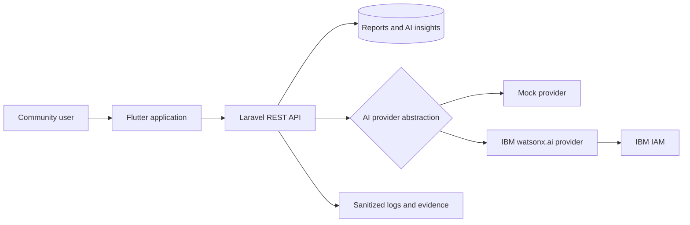

# DscienTia

**AI-assisted social data platform for community resilience and evidence-based decision-making**

Built for the **IBM AI Builders Challenge 2026**.

DscienTia transforms community-generated reports into structured risk assessments, concise summaries, and recommended actions for NGOs, community leaders, social-impact organizations, and researchers.

> Current status: the Flutter application and Laravel API are deployed, the mock AI workflow is verified, the IBM watsonx provider implementation is complete, and controlled live watsonx verification is pending approved IBM Cloud access.

---

## Project Overview

Many social-impact organizations still rely on fragmented reports, spreadsheets, messaging apps, and manual follow-up. This makes it difficult to identify emerging risks, compare needs across communities, and prioritize interventions consistently.

DscienTia provides a mobile-first reporting and decision-support workflow that helps organizations:

- collect structured community reports;
- convert observations into consistent analytical records;
- classify urgency and community risk;
- generate concise summaries and recommended actions;
- preserve evidence for monitoring, evaluation, and research;
- support more transparent and data-informed decisions.

DscienTia is not a clinical, diagnostic, or autonomous decision-making system. It is an AI-assisted social-data and community-resilience platform designed to support human judgment.

---

## Social Data Science Relevance

DscienTia explores how social data can be collected, structured, interpreted, and governed responsibly.

The project connects software engineering with key Social Data Science questions:

- How should community observations be transformed into analyzable data?
- How can data quality, missing context, and representation affect conclusions?
- How should AI-generated recommendations communicate uncertainty?
- How can privacy, consent, accountability, and human oversight be built into the workflow?
- How can community-level data support NGOs and researchers without overstating what the evidence proves?

This framing makes DscienTia both a technical product and a practical research portfolio project.

---

## Current Working Scope

### Implemented and verified

- Flutter web application foundation
- Laravel 12 REST API
- Community risk report creation and retrieval
- Structured AI insight API
- Provider abstraction for mock and IBM watsonx
- Synthetic-data verification workflow
- Safe fallback and sanitized error handling
- Preflight gate for controlled watsonx verification
- Production smoke testing with the mock provider
- Deployment documentation and evidence logs

### Current AI behavior

The verified production workflow currently uses the local mock provider:

```env
DSCIENTIA_AI_PROVIDER=mock
```

The IBM watsonx provider has been implemented behind the Laravel service layer and includes:

- IBM IAM token handling;
- watsonx HTTP client integration;
- prompt construction;
- structured response mapping;
- retry handling;
- safe fallback behavior;
- sanitized exception logging;
- controlled-verification safety checks.

A live IBM watsonx request has not yet been claimed as complete. Controlled live verification remains pending IBM Cloud account, Project ID, runtime, API key, and regional model availability.

---

## IBM Technology Usage

### IBM Bob

IBM Bob has been used as an AI software-development partner for:

- repository and architecture review;
- implementation planning;
- code-quality and safety analysis;
- verification-readiness review;
- identifying blockers for controlled watsonx testing.

### IBM watsonx.ai

The repository contains an implemented watsonx provider integration. It is isolated behind the Laravel backend so the Flutter client never receives IBM credentials or calls watsonx directly.

Target workflow:

```text
Flutter application
        |
        v
Laravel REST API
        |
        v
AI provider abstraction
   |              |
   v              v
Mock provider   IBM watsonx.ai
```

Production remains on the mock provider until controlled live verification and a separate production-readiness review are complete.

---

## Architecture



### Design principles

- **Backend-controlled AI access:** IBM credentials remain server-side.
- **Provider abstraction:** mock and watsonx implementations share a stable application contract.
- **Human decision support:** AI output supports review rather than replacing accountable decision-makers.
- **Synthetic verification:** live-provider testing is designed around non-personal test data.
- **Fail-safe activation:** preflight checks block requests when critical configuration is missing.
- **Evidence-driven development:** smoke tests, runbooks, and verification logs are stored with the project.

---

## Technology Stack

### Frontend

- Flutter
- Dart
- Riverpod
- Repository-pattern data access

### Backend

- Laravel 12
- PHP
- REST API
- Provider-based AI service architecture

### Data

- MySQL in production
- SQLite for local verification and automated testing

### AI and development tooling

- IBM Bob
- IBM watsonx.ai provider integration
- IBM Granite model configuration
- Mock AI provider for safe development and production demonstration

### Deployment

- Landing page: `https://www.dscientia.dev`
- Flutter web app: `https://app.dscientia.dev`
- Laravel API: `https://api.dscientia.dev`

---

## Example Workflow

### 1. Submit a community report

```http
POST /api/reports
```

Example synthetic payload:

```json
{
  "organization_name": "DscienTia Verification Lab",
  "reporter_name": "Synthetic Test Runner",
  "category": "community_resilience",
  "location": "Synthetic Community Zone A",
  "urgency": "medium",
  "description": "A fictional community reported temporary disruption to safe water access after simulated infrastructure damage.",
  "affected_people_count": 75,
  "status": "open"
}
```

### 2. Generate a structured insight

```http
POST /api/ai-insights
```

```json
{
  "report_id": 4,
  "insight_type": "community_risk_summary"
}
```

The structured response includes:

- risk level;
- narrative summary;
- summary points;
- recommended actions;
- confidence score;
- model provider and model name;
- completion status.

---

## Responsible AI and Safety

DscienTia currently applies the following safeguards:

- no IBM credentials in the Flutter client;
- no credentials committed to Git;
- synthetic data for controlled provider verification;
- explicit provider and fallback configuration;
- sanitized exception logs;
- structured output validation;
- transparent `model_provider` metadata;
- no clinical or diagnostic claims;
- human review expected before operational action;
- production activation separated from implementation and testing.

Known limitations are documented rather than hidden. AI output may be incomplete, context-sensitive, or unsuitable for direct action without human validation.

---

## Verification Status

| Capability | Status |
|---|---|
| Flutter-to-Laravel production flow | Verified |
| Community report API | Verified |
| Structured mock AI insight | Verified |
| Production smoke test | Verified |
| watsonx provider implementation | Complete |
| Pre-cloud safety gate | Verified |
| Controlled live watsonx request | Pending IBM Cloud access |
| Production watsonx activation | Not authorized |

Evidence is available under:

```text
docs/evidence/mvp-014/
docs/evidence/mvp-015e/
```

Controlled verification documentation:

```text
docs/deployment/MVP-015E-Controlled-Watsonx-Verification.md
```

---

## Repository Structure

```text
backend/dscientia_api/       Laravel API and AI provider integration
frontend/dscientia_app/      Flutter application
docs/architecture/           System and information architecture
docs/ai/                     AI design and prompt documentation
docs/backend/                Backend contracts and implementation notes
docs/deployment/             Deployment and verification runbooks
docs/evidence/               Smoke-test and verification evidence
docs/roadmap/                Product vision and roadmap
scripts/smoke/               Production smoke-test scripts
scripts/verification/        Controlled verification utilities
```

---

## Local Development

### Backend

```bash
cd backend/dscientia_api
composer install
cp .env.example .env
php artisan key:generate
php artisan migrate
php artisan serve
```

### Frontend

```bash
cd frontend/dscientia_app
flutter pub get
flutter run
```

Keep local AI configuration on the mock provider unless you are following the controlled watsonx verification runbook:

```env
DSCIENTIA_AI_PROVIDER=mock
WATSONX_FALLBACK_TO_MOCK=true
```

---

## Roadmap

### Near term

- obtain approved IBM Cloud access;
- perform one controlled live watsonx request;
- capture sanitized evidence;
- restore local configuration to mock;
- complete soft-submission assets and demo narrative.

### Future research and product directions

- longitudinal community-risk analysis;
- geospatial social-data analysis;
- bias and representation evaluation;
- uncertainty-aware recommendations;
- cross-organization impact comparison;
- participatory data-governance workflows;
- responsible community wellbeing indicators;
- research exports and reproducible analytical reports.

---

## Author

**Prio Kus Nugroho**<br>
BSc Computer Science candidate, University of the People<br>
Founder and Product Architect, DscienTia
