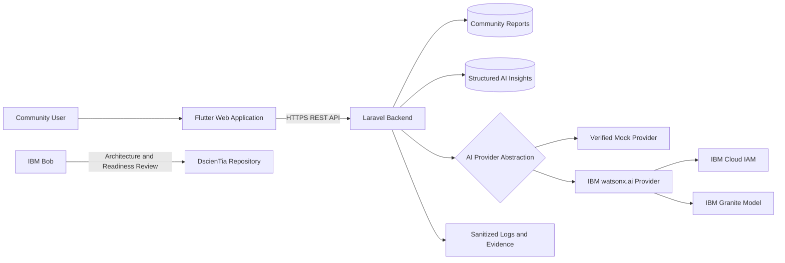

# IBM AI Builders Challenge — Submission Answers

## Document Purpose

This document provides consistent, submission-ready answers for the IBM AI
Builders Challenge dashboard, project profile, judging materials, demo
description, and related forms.

All statements reflect the current verified condition of the DscienTia project.

---

# 1. Project Identity

## Project Name

DscienTia

## Project Tagline

AI-assisted social data for community resilience and evidence-based decisions.

## Short Project Description — Approximately 100 Characters

AI-assisted platform turning community reports into structured risk insights and actions.

## Short Project Description — Approximately 250 Characters

DscienTia is an AI-assisted social data platform that transforms structured
community reports into risk assessments, concise summaries, and recommended
actions for NGOs, community leaders, social-impact organizations, and
researchers.

## One-Sentence Value Proposition

DscienTia helps social-impact organizations transform fragmented community
reports into structured risk insights and recommended actions for responsible
human decision-making.

## Suggested Project Categories

- Social Impact
- Community Resilience
- Responsible AI
- Social Data
- Decision Support
- Nonprofit Technology
- Data for Development
- Community Intelligence

## Suggested Keywords

```text
Social Data Science
Community Resilience
Responsible AI
Social Impact
NGO Technology
Community Risk
Decision Support
Flutter
Laravel
IBM Bob
IBM watsonx.ai
IBM Granite
```

---

# 2. Project Overview

DscienTia is an AI-assisted social data and community-resilience platform
designed to help NGOs, foundations, community leaders, social enterprises,
volunteers, monitoring and evaluation teams, and researchers collect,
structure, interpret, and act upon community-generated information.

Community organizations frequently receive important observations through
messaging applications, spreadsheets, informal documents, phone calls, and
separate reporting systems. These reports may contain valuable evidence about
infrastructure problems, resource shortages, public-service disruptions,
community needs, and emerging risks.

However, fragmented reporting makes the information difficult to compare,
prioritize, analyze, and use consistently.

DscienTia provides a mobile-first workflow in which users submit structured
community reports containing information such as:

- organization;
- reporter;
- issue category;
- location;
- urgency;
- detailed description;
- estimated number of people affected;
- report status;
- supporting source link when available.

The Laravel backend validates and stores the report, then processes it through
an AI provider abstraction. The resulting structured insight can include:

- risk level;
- narrative summary;
- key findings;
- recommended actions;
- confidence score;
- provider identity;
- model name;
- processing status.

The objective is not to replace accountable human decision-makers. DscienTia
is designed to support NGOs, community leaders, researchers, and social-impact
teams with clearer, more structured, and more transparent information.

---

# 3. Problem Statement

Many social-impact and community organizations still manage important field
information through disconnected tools.

Common problems include:

- fragmented field reports;
- inconsistent report structures;
- manual monitoring processes;
- delayed identification of emerging risks;
- difficulty comparing needs across locations;
- limited visibility into the number of people affected;
- inconsistent intervention prioritization;
- significant manual effort for monitoring and evaluation;
- limited transparency in decision-making;
- difficulty preparing data for research or impact analysis.

When community information is fragmented, organizations may respond too late,
duplicate effort, overlook vulnerable groups, or make decisions without
sufficiently organized evidence.

The problem is not simply a lack of data. The larger problem is that community
data is often unstructured, disconnected, context-dependent, and difficult to
translate into responsible action.

---

# 4. Proposed Solution

DscienTia provides an end-to-end workflow that:

1. collects structured community reports;
2. validates report data through a Laravel REST API;
3. stores reports for review and traceability;
4. sends approved report data through an AI provider abstraction;
5. generates a structured community-risk insight;
6. presents summaries and suggested actions for human review;
7. exposes provider and confidence metadata transparently;
8. preserves technical evidence for verification and accountability.

The platform separates the user-facing Flutter application from AI-provider
credentials and model communication. IBM credentials remain exclusively in the
backend environment.

This architecture supports safe development using a mock provider while also
allowing an IBM watsonx provider to be integrated behind the same application
contract.

---

# 5. Target Users

## NGOs and Foundations

DscienTia can help NGOs and foundations organize community reports, identify
priority needs, monitor interventions, and support evidence-informed program
decisions.

## Community Leaders

Community leaders can document local issues, communicate urgency, track
follow-up, and coordinate responses with relevant organizations.

## Volunteers and Field Workers

Volunteers and field workers can submit structured observations from community
activities instead of relying only on informal messages or disconnected notes.

## Monitoring and Evaluation Teams

Monitoring and evaluation teams can use structured reports and insight records
to support review, prioritization, documentation, and future impact analysis.

## Researchers

Researchers can explore how community-generated observations are transformed
into social data while examining data quality, representation, uncertainty,
bias, and responsible interpretation.

## Social Enterprises

Social enterprises can use the platform to document community needs and align
products or services with evidence from the field.

## Local Governments and Public-Service Partners

Future versions may support public-service teams through structured issue
reporting, transparent prioritization, and accountable inter-organizational
coordination.

---

# 6. Social Impact

DscienTia aims to improve how community-level evidence is collected,
structured, interpreted, and used.

Potential social impact includes:

- earlier identification of community needs;
- more consistent risk prioritization;
- improved documentation of vulnerable populations;
- clearer coordination between organizations;
- more transparent intervention planning;
- reduced dependence on fragmented reporting;
- stronger evidence for monitoring and evaluation;
- improved accountability in social-impact programs;
- better foundations for community-resilience research;
- more responsible use of AI in nonprofit and community settings.

The platform is particularly relevant in environments where organizations must
work with limited resources, inconsistent data, and urgent community needs.

DscienTia does not assume that AI-generated text is automatically correct.
Human review, local knowledge, contextual validation, and organizational
accountability remain essential.

---

# 7. Social Data Science Relevance

DscienTia is both a software-engineering project and a practical Social Data
Science portfolio project.

It explores how social observations become structured data and how analytical
systems may influence real-world decisions.

Key Social Data Science questions include:

- How should community observations be transformed into analyzable records?
- Which data fields are necessary for meaningful comparison?
- How does missing context affect risk interpretation?
- Whose perspectives may be overrepresented or underrepresented?
- How can AI-generated recommendations communicate uncertainty?
- How should confidence scores be interpreted?
- How can community data be governed responsibly?
- What privacy and consent mechanisms are required?
- How can organizations avoid treating model output as objective truth?
- How should human oversight be incorporated into decision workflows?
- How can researchers evaluate fairness across communities and locations?
- How can structured reports support longitudinal or geospatial analysis?

DscienTia therefore connects:

- data collection;
- social research;
- software architecture;
- responsible AI;
- community resilience;
- monitoring and evaluation;
- evidence-informed decision-making.

---

# 8. Core Product Features

## Community Risk Reporting

Users can submit structured reports containing:

- organization name;
- reporter name;
- category;
- location;
- urgency;
- description;
- estimated affected population;
- status;
- optional source URL.

## Report Validation

The Laravel API validates required fields, allowed urgency levels, report
length, status values, numeric ranges, and optional URLs.

## Structured AI Insight

The AI insight workflow produces a standardized result containing:

- risk level;
- narrative summary;
- summary points;
- recommended actions;
- confidence score;
- model provider;
- model name;
- status.

## Provider Abstraction

DscienTia separates the application workflow from the AI provider.

Current provider options include:

- verified mock provider;
- implemented IBM watsonx provider.

## Transparent Provider Metadata

API responses identify which provider produced the result.

Examples:

```text
model_provider=mock
```

```text
model_provider=mock-fallback
```

A future controlled live result must show:

```text
model_provider=watsonx
```

## Safe Fallback

The watsonx integration supports a safe mock fallback when configured.

During controlled live verification, fallback must be disabled so that an IBM
request failure cannot be incorrectly presented as a successful watsonx result.

## Verification Preflight

A preflight script checks:

- local environment;
- selected provider;
- fallback status;
- IBM Cloud API key presence;
- watsonx Project ID presence;
- HTTPS endpoint configuration;
- IBM IAM endpoint;
- API version;
- model configuration.

The script does not display secret values and does not contact IBM.

## Evidence Workflow

The repository contains evidence for:

- production smoke testing;
- mock insight verification;
- pre-cloud readiness;
- IBM Bob review;
- submission visuals.

---

# 9. IBM Technology Used

## IBM Bob

IBM Bob has been actively used as an AI software-development partner throughout
the DscienTia development process.

IBM Bob supported:

- repository analysis;
- architecture review;
- implementation planning;
- code-quality assessment;
- AI-provider readiness review;
- retry and fallback review;
- prompt-validation review;
- error-handling review;
- controlled-verification planning;
- identification of IBM Cloud blockers;
- verification-readiness assessment.

Evidence is stored in:

```text
docs/evidence/ibm-bob/
```

The repository includes a screenshot showing IBM Bob reviewing the
`feature/watsonx-provider` branch and evaluating the readiness of the DscienTia
watsonx implementation.

IBM Bob usage is confirmed and documented.

---

## IBM watsonx.ai

DscienTia includes an implemented IBM watsonx provider behind the Laravel
backend.

The implementation includes:

- IBM IAM token client;
- watsonx HTTP client;
- backend-only credential handling;
- configurable watsonx base URL;
- configurable API version;
- configurable Project ID;
- configurable model ID;
- prompt construction;
- supported insight-type validation;
- structured response mapping;
- retry handling;
- fallback handling;
- sanitized exception logging;
- provider metadata;
- controlled-verification preflight.

The Flutter client does not communicate directly with IBM watsonx.ai.

Target architecture:

```text
Flutter Application
        |
        v
Laravel REST API
        |
        v
AI Provider Abstraction
   |                |
   v                v
Mock Provider    IBM watsonx.ai
```

---

## IBM Granite Models

The watsonx configuration contains an IBM Granite model identifier for the
planned controlled verification.

However, the repository does not claim that a successful live Granite request
has already been completed.

Model availability must be confirmed for the selected IBM Cloud region and
watsonx project before controlled verification.

---

# 10. Current IBM Integration Status

## Completed

- IBM Bob activated and used;
- IBM Bob review evidence documented;
- watsonx provider abstraction implemented;
- IBM IAM token client implemented;
- watsonx HTTP client implemented;
- prompt builder implemented;
- structured response mapper implemented;
- retry policy implemented;
- safe fallback implemented;
- sanitized logging implemented;
- unit and feature tests implemented;
- pre-cloud safety gate implemented;
- synthetic verification fixture prepared;
- mock structured insight verified;
- verification runbook documented.

## Pending

- active IBM Cloud account;
- approved educational or challenge access;
- watsonx.ai project;
- watsonx Runtime access;
- valid Project ID;
- IBM Cloud IAM API key;
- confirmation of Granite model availability;
- one controlled live watsonx request;
- sanitized live evidence;
- post-verification rollback evidence.

## Current Production Provider

```env
DSCIENTIA_AI_PROVIDER=mock
```

Production remains on the mock provider.

## Current Live Verification Statement

Controlled live IBM watsonx verification is pending approved IBM Cloud access.

The submission does not claim that a live IBM watsonx or Granite inference has
already been successfully completed.

---

# 11. Technology Stack

## Frontend

- Flutter
- Dart
- Riverpod
- feature-first architecture
- repository pattern
- responsive Flutter web interface

## Backend

- Laravel 12
- PHP
- REST API
- service-provider abstraction
- request validation
- API resources
- structured AI insight services

## Database

- MySQL for production;
- SQLite for local verification and automated tests.

## AI and Development Tools

- IBM Bob;
- IBM watsonx.ai provider integration;
- IBM Granite model configuration;
- mock AI provider;
- structured prompt and response workflow.

## Testing

- Laravel unit tests;
- Laravel feature tests;
- provider binding tests;
- IAM token client tests;
- watsonx HTTP client tests;
- prompt builder tests;
- response mapper tests;
- fallback and failure tests;
- production smoke-test scripts;
- controlled-verification scripts.

## Deployment

- Flutter web application;
- Laravel REST API;
- Hostinger hosting;
- HTTPS subdomain architecture;
- GitHub version control.

---

# 12. System Architecture



## Current Verified Workflow

```text
Community Report
    → Flutter Application
    → Laravel REST API
    → Report Validation
    → Report Storage
    → AI Provider Abstraction
    → Mock Provider
    → Structured Community Risk Insight
```

## Controlled watsonx Workflow

```text
Synthetic Community Report
    → Local Laravel API
    → Preflight Safety Gate
    → Watsonx Provider
    → IBM IAM
    → IBM watsonx.ai
    → Structured Response Mapping
    → Verification Evidence
    → Restore Local Mock Configuration
```

---

# 13. Innovation

DscienTia is not designed as a general-purpose chatbot.

Its innovation is the creation of a structured and traceable path from
community-generated evidence to responsible decision support.

Key differentiators include:

- structured community-risk reporting;
- explicit urgency and affected-population fields;
- standardized analytical output;
- transparent provider metadata;
- confidence information;
- backend-only IBM credential handling;
- swappable AI provider architecture;
- safe mock development workflow;
- explicit mock-fallback metadata;
- controlled live-verification procedure;
- synthetic-data safety;
- human oversight;
- integration of Social Data Science questions into product design.

Rather than presenting AI output as unquestionable intelligence, DscienTia
makes the provider, confidence, limitations, and verification status visible.

---

# 14. Responsible AI

DscienTia applies responsible-AI principles at both the product and engineering
levels.

## Human Oversight

AI output supports human decisions and does not automatically authorize an
intervention.

Organizations remain responsible for:

- validating the report;
- checking local context;
- consulting affected communities;
- reviewing recommendations;
- assigning resources;
- making final decisions.

## Transparency

The API exposes:

- model provider;
- model name;
- confidence score;
- processing status.

A mock or fallback result is not presented as a watsonx result.

## Data Minimization

Controlled provider verification uses synthetic data rather than real personal
or sensitive reports.

## Backend Credential Isolation

IBM credentials remain in backend environment variables and are never sent to
the Flutter client.

## Sanitized Logging

Exceptions are logged without exposing report descriptions, API keys, tokens,
or sensitive model-request content.

## Honest Capability Boundaries

DscienTia does not claim to:

- diagnose medical conditions;
- provide clinical advice;
- replace emergency services;
- replace professional humanitarian assessment;
- autonomously allocate resources;
- make final governmental decisions;
- guarantee that AI-generated recommendations are correct.

## Controlled Activation

Implementation, live verification, and production activation are treated as
separate stages.

A provider can be implemented without being activated in production.

---

# 15. Privacy and Security

Current security principles include:

- HTTPS communication;
- no AI-provider credentials in the client;
- no real credentials committed to Git;
- backend environment-variable configuration;
- sanitized error logging;
- Laravel validation;
- provider abstraction;
- production mock default;
- explicit fallback behavior;
- synthetic verification data;
- separate production activation review;
- evidence review before public submission.

Sensitive files must never include:

- IBM Cloud API keys;
- IBM access tokens;
- watsonx Project IDs when confidential;
- `.env` contents;
- private user data;
- passwords;
- billing information;
- authentication cookies.

---

# 16. Current Verified Results

## Production Deployment

- Flutter application deployed;
- Laravel API deployed;
- HTTPS endpoints available;
- production API smoke test completed.

## Report Workflow

- community report creation verified;
- report retrieval verified;
- report validation verified;
- structured report stored successfully.

## Mock AI Workflow

- synthetic report created;
- structured AI insight generated;
- risk level returned;
- narrative summary returned;
- summary points returned;
- recommended actions returned;
- confidence score returned;
- provider metadata returned;
- completion status returned.

## Example Verified Metadata

```text
model_provider=mock
model_name=dscientia-local-mock-v0.1
status=completed
confidence_score=0.72
```

## Preflight Result

The preflight gate correctly blocked live IBM verification because:

- provider remained `mock`;
- fallback remained enabled;
- IBM Cloud API key was missing;
- watsonx Project ID was missing.

The script confirmed:

```text
Ready for IBM request          : NO
Network request performed      : NO
Secret values displayed        : NO
```

This blocked state is expected and demonstrates safe behavior.

---

# 17. Evidence

## MVP-014 Production Evidence

```text
docs/evidence/mvp-014/
```

Contains:

- Flutter report form;
- Flutter-to-backend network flow;
- production smoke-test log.

## MVP-015E Pre-Cloud Evidence

```text
docs/evidence/mvp-015e/
```

Contains:

- blocked preflight evidence;
- mock insight verification evidence;
- controlled-verification documentation.

## IBM Bob Evidence

```text
docs/evidence/ibm-bob/
```

Contains:

- IBM Bob watsonx-readiness review;
- evidence description.

## Submission Visuals

```text
docs/evidence/submission/
```

Contains:

- main dashboard;
- structured AI insight result;
- visual evidence description.

---

# 18. Current Limitations

DscienTia is an active MVP and currently has several important limitations.

- Live IBM watsonx verification is pending IBM Cloud access.
- Production currently uses the transparent mock provider.
- Current AI insight generation focuses on one supported insight type:
  `community_risk_summary`.
- Current risk classification is an MVP decision-support mechanism.
- Recommendations have not been validated by governmental, humanitarian,
  medical, or clinical authorities.
- Confidence scores require further methodological evaluation.
- Current reports may not capture all relevant social context.
- Community representation and reporting bias require further study.
- The platform does not yet provide longitudinal analysis.
- Geospatial analysis is not yet implemented.
- Offline-first behavior remains future development.
- Multi-organization governance remains future work.
- The system requires human review before operational use.

These limitations are documented openly to avoid overstating current
capabilities.

---

# 19. Future Development

## Immediate Priorities

- obtain approved IBM Cloud access;
- create or join a watsonx.ai project;
- confirm Runtime availability;
- obtain a valid Project ID and IAM API key;
- confirm Granite model availability;
- perform exactly one controlled live watsonx request;
- capture sanitized verification evidence;
- restore local provider configuration to mock;
- keep production on mock until separately authorized.

## Product Development

- enhanced dashboard metrics;
- longitudinal community-risk analysis;
- report clustering;
- trend detection;
- improved confidence interpretation;
- multilingual reporting;
- offline-first field reporting;
- organization and project management;
- notification and escalation workflows;
- researcher exports;
- monitoring and evaluation dashboards.

## Social Data Science Development

- missing-data analysis;
- bias and representation evaluation;
- uncertainty-aware recommendations;
- participatory data governance;
- fairness analysis across communities;
- reproducible analytical reports;
- geospatial social-data analysis;
- community-level longitudinal studies;
- evaluation of intervention outcomes;
- transparent model-performance reporting.

## Responsible Community Wellbeing

Future wellbeing features may support non-clinical community indicators,
resource mapping, and referral information.

DscienTia will not claim medical diagnosis or replace qualified mental-health
professionals.

---

# 20. Project Links

## GitHub Repository

```text
https://github.com/littlepasluv/dscientia-mobile
```

## Public Website

```text
https://www.dscientia.dev
```

## Flutter Web Application

```text
https://app.dscientia.dev
```

## Laravel API

```text
https://api.dscientia.dev
```

---

# 21. Founder and Team

## Founder

Prio Kus Nugroho

## Role

Founder and Product Architect

## Academic Background

Bachelor of Science in Computer Science candidate at the University of the
People.

## Professional and Academic Interests

- Social Data Science
- Responsible AI
- Data Analytics
- Community Resilience
- Nonprofit Technology
- Human-Centered Product Design
- Monitoring and Evaluation
- Social Impact Research

## Team Structure

DscienTia is currently developed as an independent founder-led project.

IBM Bob has been used as an AI software-development partner for analysis,
planning, review, and readiness assessment.

---

# 22. Suggested 150-Word Pitch

DscienTia is an AI-assisted social data platform designed to help NGOs,
community leaders, social-impact organizations, and researchers transform
fragmented community reports into structured risk insights and recommended
actions.

Users submit reports containing the issue category, location, urgency,
description, and estimated number of people affected. A Laravel backend
validates and stores the report before processing it through an AI provider
abstraction. The result includes a risk level, narrative summary, key findings,
recommended actions, confidence score, and transparent provider metadata.

The current verified application uses a mock provider for safe development and
production demonstration. An IBM watsonx provider has been implemented with
IBM IAM authentication, structured prompting, response mapping, retries,
sanitized logging, and controlled-verification safeguards. Live verification
is pending approved IBM Cloud access.

IBM Bob has supported repository analysis, architecture review, implementation
planning, and watsonx-readiness assessment.

DscienTia combines software engineering, responsible AI, and Social Data
Science to support clearer and more accountable community decisions.

---

# 23. Suggested 50-Word Pitch

DscienTia transforms structured community reports into risk assessments,
concise summaries, and recommended actions. Built with Flutter and Laravel, it
uses a transparent AI-provider architecture and responsible-AI safeguards.
IBM Bob supported development and review, while controlled live watsonx
verification remains pending approved IBM Cloud access.

---

# 24. Suggested Demo Description

The DscienTia demo shows a community report moving from the Flutter web
application to the Laravel REST API and then through the AI provider
abstraction.

The resulting insight displays:

- community risk level;
- narrative summary;
- priority findings;
- suggested actions;
- confidence score;
- provider metadata.

The demonstration transparently uses the verified mock provider.

The IBM watsonx provider implementation is documented separately and remains
pending controlled live verification.

---

# 25. Suggested Video Title

DscienTia — AI-Assisted Community Resilience and Social Data Intelligence

---

# 26. Suggested Video Description

DscienTia is an AI-assisted social data platform that transforms structured
community reports into risk assessments, concise summaries, and recommended
actions.

The project combines Flutter, Laravel, responsible-AI safeguards, IBM
Bob-assisted development, and an implemented IBM watsonx provider integration.

The current demonstration transparently uses the verified mock provider.
Controlled live IBM watsonx verification remains pending approved IBM Cloud
access.

---

# 27. Suggested “Why This Project Matters” Answer

DscienTia matters because community organizations often have valuable local
information but lack a consistent way to transform it into structured,
comparable, and actionable evidence.

The project demonstrates how responsible AI can support social-impact work
without hiding uncertainty or replacing human judgment.

By combining structured reporting, provider transparency, evidence workflows,
and Social Data Science principles, DscienTia aims to improve how communities
and organizations understand risks, coordinate responses, and document impact.

---

# 28. Suggested “What Makes It Unique” Answer

DscienTia does not treat AI as a standalone chatbot.

It connects structured community reporting, validated social data, provider
abstraction, transparent model metadata, confidence information, synthetic
verification, and human oversight in one workflow.

The project also separates implementation from activation. The IBM watsonx
provider can be implemented and tested safely without prematurely enabling it
in production or claiming an unverified live result.

---

# 29. Suggested “How IBM Technology Was Used” Answer

IBM Bob was actively used to analyze the DscienTia repository, review the
architecture, identify implementation risks, evaluate fallback behavior, and
prepare the project for controlled IBM watsonx verification.

An IBM watsonx provider was implemented behind the Laravel backend. It includes
IBM IAM authentication, HTTP communication, prompt construction, structured
response mapping, retry handling, safe fallback, sanitized logging, and a
preflight safety gate.

The current verified demonstration uses the transparent mock provider.
Controlled live watsonx verification remains pending approved IBM Cloud access.

---

# 30. Suggested “Responsible AI” Answer

DscienTia uses AI as decision support rather than an autonomous authority.

Provider identity, model name, confidence score, and processing status are
exposed in the API response. Credentials remain in the backend, logs are
sanitized, controlled verification uses synthetic data, and fallback output is
identified transparently.

The project does not provide medical diagnosis, emergency decisions, or
automatic resource allocation. Human review and contextual validation remain
required.

---

# 31. Transparent Submission Statement

The current working Flutter application, Laravel API, community-report
workflow, mock AI insight generation, production smoke test, and pre-cloud
verification gate have been implemented and verified.

IBM Bob usage is confirmed and documented.

The IBM watsonx provider implementation is complete at the source-code,
automated-testing, and pre-cloud-readiness level.

A successful live IBM watsonx or Granite inference request will only be claimed
after controlled verification produces sanitized evidence showing:

```text
model_provider=watsonx
status=completed
```

Until that evidence exists:

```env
DSCIENTIA_AI_PROVIDER=mock
```

Production remains configured with the mock provider.

---

# 32. Submission Accuracy Checklist

Before copying answers into the challenge dashboard, confirm:

- [x] DscienTia name is written consistently.
- [x] GitHub repository link is correct.
- [x] Public application links are correct.
- [x] IBM Bob usage is described as completed.
- [x] watsonx implementation is described as completed.
- [x] Live watsonx verification is described as pending.
- [x] Production provider is described as mock.
- [x] No medical or diagnostic claims are made.
- [x] No API key, token, password, or Project ID is included.
- [x] Mock-provider screenshots are labeled transparently.
- [x] Human oversight is documented.
- [x] Current limitations are disclosed.
- [x] Social Data Science relevance is included.
- [x] Evidence locations are documented.
- [ ] Update live-verification status only after successful IBM evidence exists.
